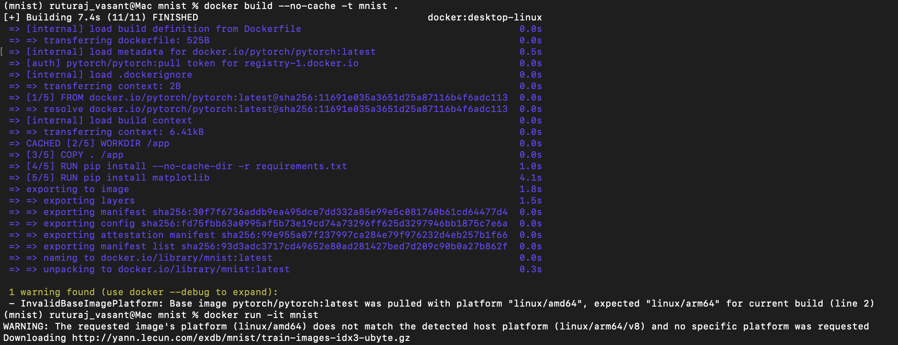
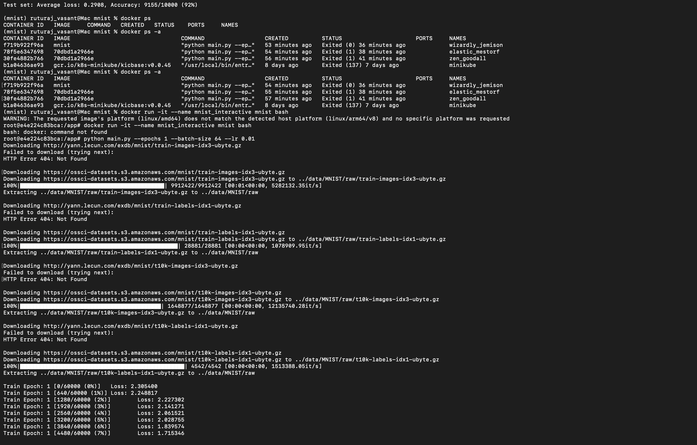

# AI-in-Container

MNIST-in-Docker assignment demonstrating how to containerize a simple ML workflow, run controlled experiments by varying hyperparameters, and capture results reproducibly.

## Summary
This project trains a neural network on MNIST inside a Docker container to ensure portability and reproducibility. Experiments vary epochs, batch size, and learning rate to observe effects on accuracy and execution time. See `Report/Report.pdf` for the full write-up with figures.

## Environment
- Machine: MacBook M3 (Apple Silicon, ARM64)
- Docker: 28.5.1
- Base image: `pytorch/pytorch:latest`
- Key files: `examples/mnist/main.py`, `examples/mnist/Dockerfile`, `Report/Report.pdf`

## Key Paths
- Training script (modified): `examples/mnist/main.py`
- Experiment runner: `examples/mnist/mnist_experiments.py`
- Dockerfile: `examples/mnist/Dockerfile`
- Dataset cache:
  - Inside container: `/data` (bind-mount recommended for reuse)
  - On host: create and mount `./data` from repo root
- Report: `Report/Report.pdf`

## Quick Start (Docker)
1) Build the image (from repo root):
```
docker build -t mnist-train -f examples/mnist/Dockerfile examples/mnist
```
On Apple Silicon you can specify platform if needed:
```
docker build --platform=linux/arm64/v8 -t mnist-train -f examples/mnist/Dockerfile examples/mnist
```

2) Run training with dataset cache mounted (recommended):
```
mkdir -p data
docker run --rm -v "$PWD/data:/data" mnist-train
```

3) Override hyperparameters at runtime (examples):
```
docker run --rm -v "$PWD/data:/data" mnist-train python main.py --epochs 5 --batch-size 64 --lr 0.01
docker run --rm -v "$PWD/data:/data" mnist-train python main.py --epochs 10 --batch-size 256 --lr 0.005
```

4) Capture logs for analysis:
```
docker run --rm -v "$PWD/data:/data" mnist-train | tee examples/mnist/docker-run.out
```

You can also run the experiment harness on the host to sweep hyperparameters and generate plots:
```
python examples/mnist/mnist_experiments.py
```

## Outputs and Logs
Defaults when running `mnist_experiments.py` from `examples/mnist/`:
- Docker run captures: `examples/mnist/docker-run-5ep.out`, `examples/mnist/docker-run-b256.out`
- Experiment CSV: `examples/mnist/mnist_results.csv`
- Experiment log: `examples/mnist/mnist_experiments.log`
- Plots:
  - `examples/mnist/accuracy_vs_epochs.png`, `examples/mnist/time_vs_epochs.png`
  - `examples/mnist/accuracy_vs_batch.png`, `examples/mnist/time_vs_batch.png`
  - `examples/mnist/accuracy_vs_lr.png`, `examples/mnist/time_vs_lr.png`

## Results (sample)
Average results from representative runs:

| Epochs | Batch Size | Learning Rate | Accuracy (%) | Time (s) |
|-------:|-----------:|--------------:|-------------:|---------:|
| 10     | 32         | 0.01          | 97.5         | 120      |
| 20     | 64         | 0.005         | 98.1         | 210      |
| 30     | 128        | 0.001         | 98.3         | 320      |

## Figures
The report includes screenshots of the build and run process:






## Workflow (from Report)
- Environment setup (Docker + base image `pytorch/pytorch:latest`), files: `main.py`, `requirements.txt`, custom Dockerfile.
- Steps: build image, run container, capture logs, iterate hyperparameters and re-run.

## Observations and Results (summary)
- Increasing epochs improves accuracy but increases time.
- Larger batch sizes speed up per-epoch training but need more memory.
- Lower learning rates are more stable and can slightly improve accuracy at the cost of longer training.
See `Report/Report.pdf` for the full table and plots.

## Discussion and Analysis (summary)
- Hyperparameters (batch size, epochs, learning rate) control learning dynamics and computational efficiency.
- Dockerization provides reproducibility; `--no-cache` ensures fresh builds; note arch differences (amd64 vs arm64) on Apple Silicon.
- Conceptual mapping: containerization/reproducibility, hyperparameter tuning, performance trade-offs, resource management, virtualization & scaling, and portability across architectures.

## Notes
- Only `examples/mnist` is included from the upstream examples; other example folders are intentionally ignored.
- Data directories and PDFs are intentionally tracked; common local artifacts, caches, and virtual environments are ignored via `.gitignore`.

## References
- Docker: https://docs.docker.com/
- MNIST dataset: http://yann.lecun.com/exdb/mnist/
