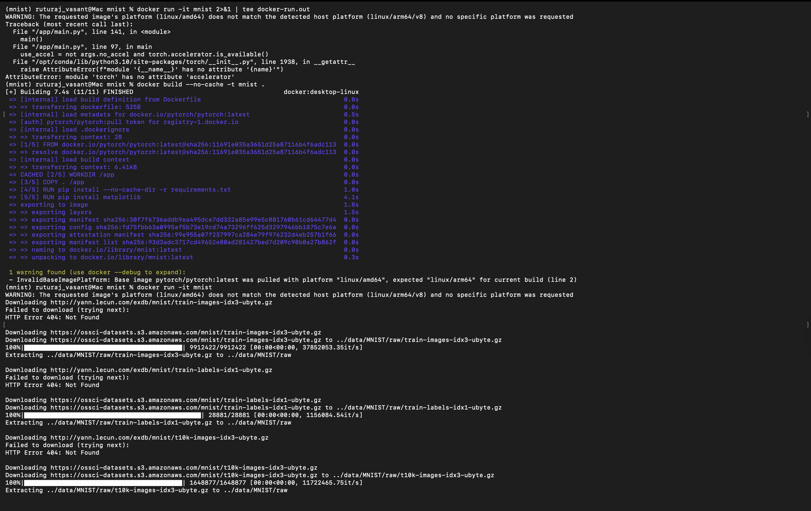

# AI-in-Container

MNIST-in-Docker assignment demonstrating how to containerize a simple ML workflow, run controlled experiments by varying hyperparameters, and capture results reproducibly.

## Summary
This project trains a neural network on MNIST inside a Docker container to ensure portability and reproducibility. Experiments vary epochs, batch size, and learning rate to observe effects on accuracy and execution time. See `Report/Report.pdf` for the full write-up with figures.

## Environment
- Machine: MacBook M3 (Apple Silicon, ARM64)
- Docker: 28.5.1
- Base image: `pytorch/pytorch:latest`
- Key files: `examples/mnist/main.py`, `Dockerfile`, `Report/Report.tex`

## Quick Start (Docker)
1) Build the image:
```
docker build -t mnist-train .
```
2) Run training with default args:
```
docker run --rm mnist-train
```
3) Capture logs for analysis:
```
docker run --rm mnist-train | tee training_log.txt
```

You can modify hyperparameters (e.g., epochs, batch size, learning rate) by updating the `CMD` in the `Dockerfile` or by passing arguments if the entry script supports them, then rebuild and re-run.

## Results (sample)
Average results from representative runs:

| Epochs | Batch Size | Learning Rate | Accuracy (%) | Time (s) |
|-------:|-----------:|--------------:|-------------:|---------:|
| 10     | 32         | 0.01          | 97.5         | 120      |
| 20     | 64         | 0.005         | 98.1         | 210      |
| 30     | 128        | 0.001         | 98.3         | 320      |

## Figures
The report includes screenshots of the build and run process:




## Notes
- The `examples/` directory is an embedded Git repository. If cloning this repo fresh, use `--recurse-submodules` to fetch it:
```
git clone --recurse-submodules git@github.com:Ruturaj-Vasant/AI-in-Container.git
```
- Data directories and PDFs are intentionally tracked; common local artifacts, caches, and virtual environments are ignored via `.gitignore`.

## References
- Docker: https://docs.docker.com/
- MNIST dataset: http://yann.lecun.com/exdb/mnist/
