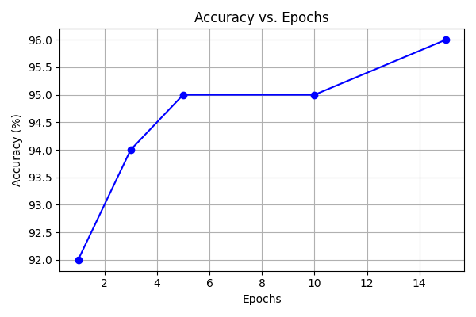
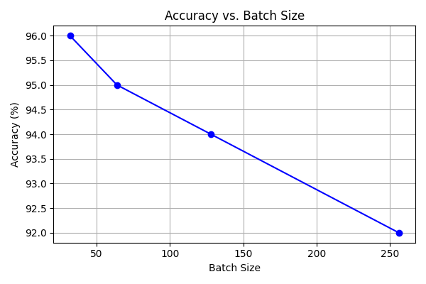
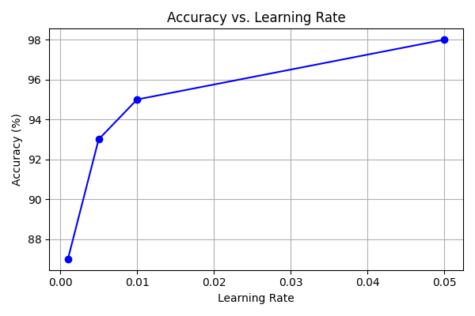
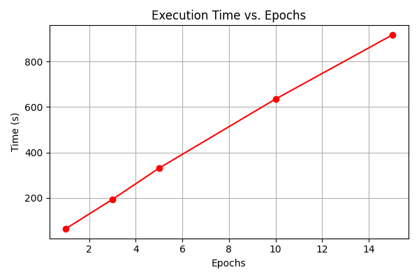
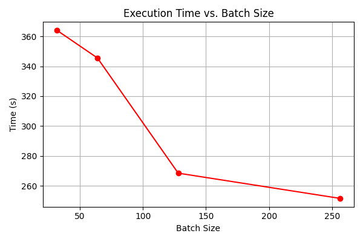
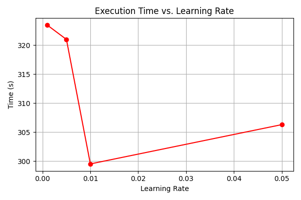

# AI-in-Container

MNIST-in-Docker assignment demonstrating how to containerize a simple ML workflow, run controlled experiments by varying hyperparameters, and capture results reproducibly.

## Summary
This project trains a neural network on MNIST inside a Docker container to ensure portability and reproducibility. Experiments vary epochs, batch size, and learning rate to observe effects on accuracy and execution time. See `Report/Report.pdf` for the full write-up with figures.


## Observations and Results
Epochs: Across the epoch sweep (epochs = 1, 3, 5, 10, 15; batch = 64; lr = 0.01), accuracy rises from 92.0% at 1 epoch to 96.0% at 15 epochs, with diminishing returns after roughly 5–10 epochs (95.0% at 5–10). Runtime scales nearly linearly with epochs (approx. 65 s to approx. 916 s), reflecting the expected cost–accuracy trade‑off.

Batch size: At fixed epochs = 5 and lr = 0.01, larger batches reduce wall‑clock time (approx. 364 s at 32 to approx. 252 s at 256) but also reduce accuracy (96.0% to 92.0%), illustrating a throughput–generalization trade‑off.

Learning rate: At epochs = 5 and batch = 64, a very small LR underfits (87.0% at 0.001), while higher LRs improve accuracy (93.0% at 0.005, 95.0% at 0.01, 98.0% at 0.05) with similar runtimes (approx. 300–323 s). This suggests an LR "sweet spot" around 0.01–0.05 for faster convergence without instability on this setup.


<!-- Three-in-a-row accuracy plots (centered) -->
<div align="center">
  
  
  
  <br/>
  <em>Figure 3. Accuracy for each sweep.</em>
  <br/>
</div>

<!-- Three-in-a-row time plots -->
<p>
  
  
  
  <br/>
  <em>Figure 4. Execution time for each sweep.</em>
</p>

### Results Table

| Category     | Epochs | Batch | LR    | Accuracy (%) | Time (s) |
|-------------:|-------:|------:|------:|-------------:|---------:|
| Epoch Sweep  | 1      | 64    | 0.01  | 92.0         | 65.03    |
| Epoch Sweep  | 3      | 64    | 0.01  | 94.0         | 193.68   |
| Epoch Sweep  | 5      | 64    | 0.01  | 95.0         | 330.95   |
| Epoch Sweep  | 10     | 64    | 0.01  | 95.0         | 634.82   |
| Epoch Sweep  | 15     | 64    | 0.01  | 96.0         | 915.94   |
| Batch Sweep  | 5      | 32    | 0.01  | 96.0         | 363.99   |
| Batch Sweep  | 5      | 64    | 0.01  | 95.0         | 345.56   |
| Batch Sweep  | 5      | 128   | 0.01  | 94.0         | 268.55   |
| Batch Sweep  | 5      | 256   | 0.01  | 92.0         | 251.71   |
| LR Sweep     | 5      | 64    | 0.001 | 87.0         | 323.47   |
| LR Sweep     | 5      | 64    | 0.005 | 93.0         | 321.00   |
| LR Sweep     | 5      | 64    | 0.01  | 95.0         | 299.51   |
| LR Sweep     | 5      | 64    | 0.05  | 98.0         | 306.29   |

## Key Paths
- Training script (modified): `examples/mnist/main.py`
- Experiment runner: `examples/mnist/mnist_experiments.py`
- Dockerfile: `examples/mnist/Dockerfile`
- Dataset cache:
  - Inside container: `/data` (bind-mount recommended for reuse)
  - On host: create and mount `./data` from repo root
- Report: `Report/Report.pdf`

## Quick Start (Docker)
Follow these simple steps (as in the report):

1) Build the image:
```
docker build --no-cache -t mnist .
```
2) Write a Dockerfile to set up the environment, specifying the base image, copying necessary files, and setting the command to run the training script:
```
CMD ["python", "main.py", "--epochs=10", "--batch_size=32"]
```

3) Run training:
```
docker run -it mnist
```

To capture output:
```
docker run -it mnist 2>&1 | tee docker-run.out
```

## Outputs and Logs
Defaults when running `mnist_experiments.py` from `examples/mnist/`:
- Docker run captures: `examples/mnist/docker-run-5ep.out`, `examples/mnist/docker-run-b256.out`
- Experiment CSV: `examples/mnist/mnist_results.csv`
- Experiment log: `examples/mnist/mnist_experiments.log`
- Plots:
  - `examples/mnist/accuracy_vs_epochs.png`, `examples/mnist/time_vs_epochs.png`
  - `examples/mnist/accuracy_vs_batch.png`, `examples/mnist/time_vs_batch.png`
  - `examples/mnist/accuracy_vs_lr.png`, `examples/mnist/time_vs_lr.png`


## Discussion and Analysis (summary)
- Hyperparameters (batch size, epochs, learning rate) control learning dynamics and computational efficiency.
- Dockerization provides reproducibility; `--no-cache` ensures fresh builds; note arch differences (amd64 vs arm64) on Apple Silicon.
- Conceptual mapping: containerization/reproducibility, hyperparameter tuning, performance trade-offs, resource management, virtualization & scaling, and portability across architectures.

## References
- Docker: https://docs.docker.com/
- MNIST dataset: http://yann.lecun.com/exdb/mnist/
